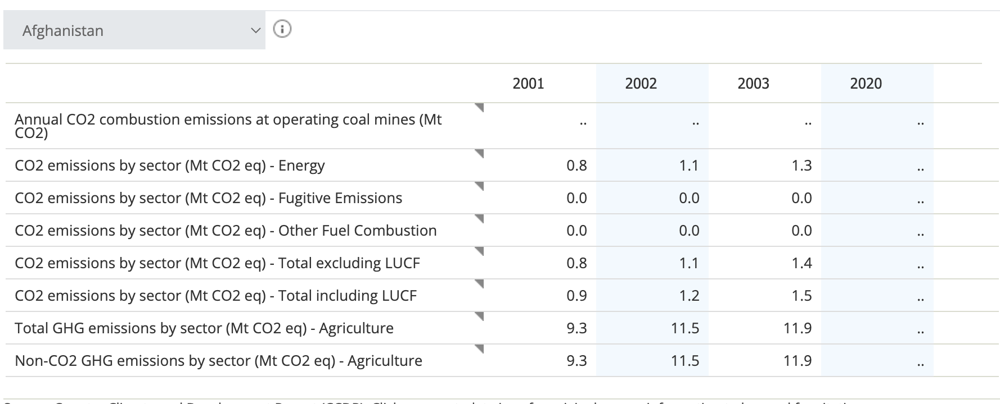

# Final Project Proposal

**GitHub Repo URL**: https://github.com/CMU-IDS-2022/final-project-michael-scott-paper-company

**Team members:**

Eeshwar Gurushankar Prasad (egurusha)  
Ramya Ramanathan (ramyar2)  
Sayani Kundu(sayanik)  
Sumanth Subramanya Rao(ssr2)

## **Problem Description**

Climate change is a global problem that affects all walks of life and is a pressing issue that needs to be addressed collectively by us. There are several factors that contribute to it and each of them to different extents. Given the widespread impact of climate change, it is important to analyze the major contributing factors and the effect. In this project, we attempt to craft a data-driven story using visualizations and interactions on climate change, its causes and some projections for the future based on current trends. We plan to look at this problem at two levels: at a country level - whether the economic status, the level of industrialization etc of a country directly correlates with how much it contributes to climate change and also at a global level - the relative amounts to which different countries and regions are impacted by climate change.

## **Proposed Solution**

The climate change problem and its causes need to be viewed from different perspectives for developed and developing countries. While developed countries have policies that aim to reduce the carbon footprint across different sectors, developing countries still use carbon-intensive processes with carbon footprint being lower in their priority. We aim to understand the implications of these relaxations and understand how they affect countries' economies, adaptation of renewable energy etc. In particular, we want to decipher the relationship between high carbon emissions, low energy optimisations and other factors in the changes in global and country-wise climate. We hope to find whether it’s justifiable for these countries to continue with the current policies or should they take charge of reducing the carbon footprint immediately. 

### **Visualizations for initial analysis**

In order to show users the variation in features like CO2 emissions, Gender parity index etc. for different countries, we can make an interactive global map plot (color coded by Country’s Human Development Index categorization) 
To analyze and understand the data, we would generate correlation heatmaps between the various features to analyze how they would correlate with the climatic change. This can be measured for each category of the attributes.
Outlier analysis would be done using the boxplot visualization to display the distribution of data and identify the thresholds for outliers. 
Dataframe visualizations would be done to identify the general trend of data, which would be based on fixing a country or a time range.

### **Datasets**

Since we want to explore various factors and attributes in our problem, we do not use a single dataset. Instead we have collected some possible datasets that can give us the different kinds of information that we want to incorporate and analyze in our proposed solution. The datasets that we intend to use are:

- Climate change data by World bank ([link](https://data.worldbank.org/topic/19))
- Surface temperature data by year ([link](https://www.kaggle.com/berkeleyearth/climate-change-earth-surface-temperature-data))
- GDP/ Country status (developed/developing) data ([link](https://data.worldbank.org/country))

The main attributes of interest that we would be dealing with is the change in Temperature and Precipitation, per country and over the years. To identify contributing factors to climatic change, the attributes in the world bank datasets can be broadly classified into six categories, namely air pollutants, energy, agricultural presence, education, population and poverty indicators. This project would analyze the impact of each of these categories over climatic change over the years, and for each of the countries listed in the dataset.

As an extension, we could predict the impact on surface temperature assuming the current rate of emissions and at lower and higher rates - to understand how aggressively policies need to be put in place.

### **Sketches and Data Analysis** 

#### **Data Processing** 

#### Data Cleaning
We are using the WorldBank dataset for Country Climate and Development Report (CCDR). The dataset consists of more than 100 metrics over the years in the range of 1950-2020.  The dataset is very sparse for certain metrics and also has many missing fields. We plan to filter the dataset by the desired metric and further clean the data by removing missing data. We also plan to reduce the data volume by choosing countries of interest or countries which are representative of most data points we plan to demonstrate. 
 
#### Data Processing 
We will first filter the dataset to contain only the desired metrics. We also plan to derive additional metrics which are aggregated over all the countries to analyze the global trend. We also plan to bin the countries into developed and developing categories and obtain category specific metrics to understand the implications. We also plan to combine multiple related metrics(e.g., co2 emissions from various sources) to obtain more consolidated data points. 

 

