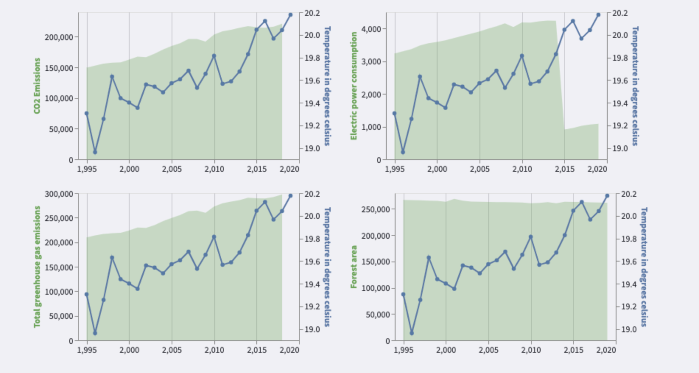

# Final Project Report

**Project URL**: https://share.streamlit.io/cmu-ids-2022/final-project-michael-scott-paper-company/main

**Team Members**
Team Michael Scott Paper Company 

**Team Members**
Eeshwar Gurushankar Prasad (egurusha)  
Sayani Kundu (sayanik)  
Sumanth Subramanya Rao (ssr2)  
Ramya Ramanathan (ramyar2)

**Video URL**: TODO

## Abstract

Climate change is a global problem that affects all walks of life and is a pressing issue that needs to be addressed collectively by us. There are several factors that contribute to it and each of them to different extents. Given the widespread impact of climate change, it is important to analyze the major contributing factors and the effect. In this project, we attempt to craft a data-driven story using visualizations and interactions on climate change, its causes and some projections for the future based on current trends. We plan to look at this problem at two levels: at a country level - whether the economic status, the level of industrialization etc of a country directly correlates with how much it contributes to climate change and also at a global level - the relative amounts to which different countries and regions are impacted by climate change. In addition to this, we also use projections of temperature into the future and develop a model to predict the extent of Arctic Sea ice sheets and visualize them.

## Introduction

Global Warming has been a pressing issue that has raised concerns about the quality of life in the future.The temperature across the world has been increasing at an alarming rate, which can lead to devastating consequences that disrupt the natural order, such as increase in surface temperature, anomalies in precipitation, and melting of glaciers. This can often be attributed to human activities that lead to greenhouse gas emissions, etc. 

While we often hear about global warming and its effects, we are often oblivious about the gravity and urgency of the situation, and about  how immediate actions must be taken to preemptively prevent our world from succumbing to the effects of global warming. In addition to this, the data present for this problem is often scattered, inconsistent and may be unreliable unless accurately verified, and preprocessed. Understanding the gravity of the situation is hard even with numbers to back it up. For instance, the global average temperature has increased by around 1 degree celsius in the last century. But, the effects are more observable when one looks at other metrics such as increase in sea level, the frequency of the natural disasters, or the reduction in area of polar ice caps.   

This brings out a need for a website which collates global warming data from multiple sources and collates them into a series of visualizations, which not only convey the relevant factual data, but also do so in a way that effectively brings about interest and awareness to this predominant issue. 

## Related Work

One significant paper that thoroughly researches all the existing methods is: Exploring the Role of Visualization in Climate Change Communication – an Audience Perspective ([link](https://www.diva-portal.org/smash/get/diva2:1204420/FULLTEXT01.pdf)).  The paper exhaustively lists all the theoretical and methodological foundations used in climate change communication and the Web-based Visualization:	VisAdapt. 

Another source of research on this topic comes from the World Bank data ([link](https://data.worldbank.org/)) The world bank research page highlights the various factors affecting climate change. The website shows statistics on each country and various other metrics. 

Our work derives many data files from the above mentioned data source ([link](https://data.worldbank.org/topic/19)) and builds on top to provide a consolidated visualization. Our aim was to provide users with a concrete and realistic idea of the extent of climate change and yet keep the visualizations simple enough for easy comprehension. We try to model the various causes and effects of climate change in the current world and end with a projected model of the state of ice sheets in the future. 

## Methods

In order to derive insights about the information of this project, data was collected, and calibrated to ensure consistency across data. For example, multiple data sources were scanned to identify relevant metrics that could potentially impact the change in temperature across the world, and were scaled to ensure they were comparable. The data was preprocessed in multiple ways including the generation of absolute temperature, and difference in temperature between consecutive years, from a temperature difference with respect to a baseline.  This data was then analyzed using correlation analysis with the target columns using the Pearson correlation method, to check for relevancy of the attribute for machine learning and analysis. 

Eventually, upon sufficient analysis, we identified that most pertinent machine learning to this website would be to predict the depletion in the amount of ice present in the world, which was an effective visualization that conveyed the seriousness of the issue.

In order to achieve this prediction, we used the metrics data and the projected temperature data generated from the Shared Socioeconomic Pathways (SSPs), which are the projected temperatures that the world could take in the future. Using this data as features, we experimented with a Support Vector Regression model to generate the predictions of percentage depletion of ice caps, which has been represented as a pie chart in the website.  

Support Vector Regression is a method that uses Support Vector Machine based hyperplane learning, which is able to handle both linearity and non-linearity in data. This is an adaptation of Support Vector Machine which is used to classify data using a hyperplane. However, in this case of regression, the decision boundaries are used to predict the continuous output, by considering points on either side of the plane to be support vectors, and hence plot the predicted line. The hyperplane which is able to fit the maximum number of points is considered the best fit. The advantage of using this method is its ability to generalize to new data, and handle outliers effectively. 

## Results

In order to explore the data and provide insights on the causes and effects of global warming we carry out multiple experimentations and consolidate the following:

* ### Exploration -

   To emphasize the importance of this project we plot the surface temperature and sea-level at a global scale over the past decades and from our plots it is very evident that there has been an average 1 degree increase in the temperature over the last century. The sea level has also increased by ~100mm over the last 30 years. These are the direct consequences of global warming and make it crucial to bring about awareness of how destructive climate change can be and what are some of the major features contributing to it. The data used for the plots were sourced from NASA's climate change repository([link](https://climate.nasa.gov/)).

* ### Major factors affecting climate change -

   In the next visualization we wanted to explore how the surface temperature of the countries around the world have changed over time. At the same time it would be crucial to find the factors that could potentially affect climate change over time. For the first portion of the visualization we used a world map and reproduced a heatmap to show to what extent a country had undergone temperate change over a given period of time. We give the users the option to choose the year range for which they want to see the change via an interactive slider.  For the second part of the visualization, we give the user an option to select a country of their choice and we display the plot of 4 major metrics (that we observed to be affecting surface temperature, namely - CO2 emissions, electricity power consumption, forest area and greenhouse gas emissions) over the last 25 years. The data used for the plots were sourced from NASA's climate change repository([link](https://climate.nasa.gov/)) and  World Bank data ([link](https://data.worldbank.org/)).

   Thus, when the user chooses a year range from the slider, they can see which countries were impacted the most and the least by global warming over that period. On further selecting a country, we display 4 plots, each having the surface temperature and the corresponding metric value over the years. This enables us to determine the correlation of these metrics with climate change ( both at a global level and if there are any country specific trends). One such trend can be seen for Germany and is explained in the Discussions section.

* ### Economic Impact on Climate - 

   When we talk about effects of metrics like CO2 emissions and power consumption for different countries, the obvious question that would come to mind is do all countries behave similarly and would some countries show unique trends in the data over time depending on their industrial engagement and financial status? If we can identify some patterns in certain groups of countries we would be able to understand where to focus when tackling climate change.

   In order for users to understand such a scenario, we categorize our countries into 4 buckets based on their income. Then, we plot the average value for each of the metrics named above for the user to compare and contrast any significant differences in the trends between each category of income. We would provide a dropdown for the user to choose a metric one at a time and analyze such patterns. Using the World Bank data ([link](https://data.worldbank.org/)) data we observed some interesting trends that are elaborated in Discussions.

* ### Impact of Greenhouse Gasses over the years - 

   Since greenhouse gasses play a major role in contributing to climate change and global warming, we wanted to see how they have been distributed over time. To this end, we explored the World Bank data ([link](https://data.worldbank.org/)) and found out that CO2, methane and nitrous oxide are the three major greenhouse gas emissions and they have been continually increasing over the years. Since CO2 has the biggest impact among all gases, it would be interesting to see which industries have majorly released carbon dioxide and if the major contributor has changed in the past 4 decades. For this we allow the users to select the continents on which they would like to see the CO2 contributions ( multiple selection as they may want to see an entire zone together). We then plot bar charts to show the major contribution amount from industries like coal, gas, oil etc. This would provide details about the industries one should focus on if we want to reduce CO2 emissions in the future. One important thing to note is there is a trade CO2 value that can have negative values. CO2 from trade is the net of carbon dioxide which is imported or exported via traded goods with an economy. A positive value denotes that a country or region is a net importer of CO2 emissions, a negative value indicates a country is a net exporter. 
   

* ### Impact of rising temperatures on ice sheets at the poles -

   In this section, we explore the effects of climate change on the average global surface temperature and the effect on the ice extent in the Arctic Sea. For this, we have obtained projected values of temperature from 'Shared Socioeconomic Pathways' (SSPs). The SSPs provide 5 pathways the world could take ranging from a sustainability-focused growth to unconstrained growth in economic output and energy use.

   Based on these temperature projections, we have trained a simple regression that predicts the area of remaining ice extent in the Arctic sea. In some of the extreme cases such as SSP5, we see that we might not have any ice caps left at the North Pole.

   We saw that SSP ranges from 0 - 5  projected temperatures in the range of 10-20 degrees.We took these temperature values from the existing years and the corresponding ice extent area and trained a SVR regression model.  For the increase in temperature, our trained model gave fairly good results on the projected amount of ice extent. We observed that SSP1 was the most sustainable pathway forward. We could see that with the SSP1 pathway even in the worst case scenario, the ice sheet extent will not go extinct. Contradictorily, SSP5 was the most harmful model where an increase in the temperature of 20 degrees would melt all the ice in poles and possibly cause catastrophic effects. Although these results might vary based on circumstances and other factors, it provides us with an indication on the harmfulness of the levels of temperature.

## Discussion

Insights that can be derived from the project developed are as follows: 
* Increasing trend of sea levels and global average temperatures - 	On observing the trend over several decades, it can be inferred that there has been a significant increase (about 1 degree) in temperature and sea level (about 100 mm), indicating that global warming is a pressing issue. 
* On looking at the data at a global level, at the scale of decades of time, we can observe the following:
   * Overall increase in the temperature for most countries (seen in the range of ~2 degree celsius)
   * For many countries such as Russia, China, Congo, Mexico and Kenya, it is observed that the temperature increase can be correlated with the increase in metrics such as CO2 emission, Electric power consumption and Total greenhouse gas emissions, and negatively correlated with the forest area present, i.e, increase in temperature happens with decrease in forest area. 
   * For certain countries like Germany, there has been significant effort to reduce CO2 emissions, however, the temperature still remains high, which may be related to the electric power consumption of the country. 
* While looking at the economy based trends of metrics, we notice that
   * The CO2 emission for high income countries are decreasing indicating the policies and steps they may have taken in the recent past to tackle the global warming problem. However, for upper and lower middle income countries the emissions keep rising (yet to take actions to prevent this or effects not seen yet).
   * We also observe that for all metrics except forest area the low income groups have a very low average value, indicating lesser industrialization in these areas.
   * Electric power consumption also sees a similar trend with high income countries controlling the electric power consumption ( flattening curve) whereas the rest still have an increasing trend.
* By observing the breakdown of greenhouse gas emissions, we notice that:
   * There is an increasing trend in the amount of greenhouse gases generated, mainly with a major increase in the amount of CO2 produced
   * CO2 forms the major contributor to greenhouse gas emissions for any specific year
   * Oil, coal and gas are major contributors for the production of CO2, and are proportionately increasing over the years. This trend stays consistent across most continents. 
   * For Europe, Africa and North America, CO2 emissions due to coal have reduced over the years, and this might be because of steps taken to reduce emissions from traditional fuel sources such as coal.
* Finally, by observing the projected values of temperatures and the arctic sea ice extent graph, we can see the following: 
   * The projected values of temperatures determined by the Shared Socioeconomic Pathways (SSPs), 5 pathways have been defined based on the economy and the energy use. These projections are not as distinct as one would expect, they tend to have a varying graph which seems realistic, when considering several factors. These result in 5 different end values of surface temperature at the end of the projected period, i.e., 2050. 	
   * In addition to this, we observe the predictions of ice area gradually reducing with the passage of time, on all of the projections. On selecting points on the temperature graph, we can observe that for the extreme cases such as the worst possible projection, there is no remaining existence of ice, since they would all be depleted, which implores us to think about our carbon dioxide emissions. 

## Future Work

We have demonstrated a visual app that effectively summarizes a key pressing problem faced by our planet in the ecosystem.  We summarized the major effects of climate change on the planet and also outlined the causes using visually powerful tools that allow users the flexibility to browse through the  various causes at varying levels of granularity.  

Although we have been able to show the various causes such as co2, greenhouse gasses and the contribution in the temperature increase, the data sources had a lot of ambiguity in them. We consolidated  the data from many sources in order to arrive at the consistent data. Hence, a consolidated and validated open source data is needed for the research community in order to avail easy access for the data for future work. 

Another dimension in which the work can be progressed is using machine learning models with sparse data.  For example, the data for temperature and co2 is at a much lower granularity to train a machine learning model. Hence leveraging the data sources and training optimized models to get more robust models. 

## References 

1. https://www.diva-portal.org/smash/get/diva2:1204420/FULLTEXT01.pdf)
